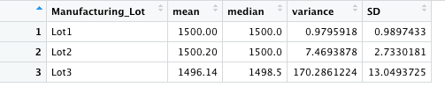

## Study Design: MechaCar vs Competition

# P-Value and R-value:

#          Lot Summary                vs                       Total Summary

               

# T-Test

                            
                            
                            

             
