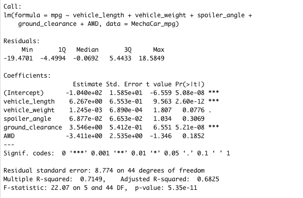
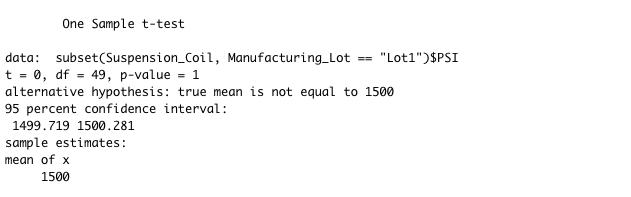

## Study Design: MechaCar vs Competition

# P-Value and R-value:

#          Lot Summary                vs                       Total Summary

               

# T-Test

                            
                            
                            
# Lot 1
     

# Lot 2
       

# Lot 3
 

I am going to test the performance of MechaCar. In order to get good results, we should test them by using the metrics that I mentioned above and compare the MecharCar with population to see how does MecharCar work. The power of the machine is one of the factors that help MechaCar to have better performance than other competitors. Hypotheses would be the following for the one-sided t-tests:

H0: The mean power of the machine of MechaCar is =<  to the mean mean power of the machine of the population

HA: The mean power of the machine of MechaCar is > the mean power of the machine of the population

The hypothesis test can help customers can better understand our car before making decision. Customers can also see the strengths of MechaCar compared to other competitors. It looks like a way to do marketing that makes it possible to sell more cars in the future.
